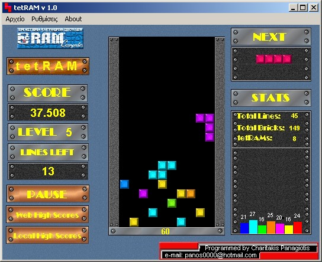



## Tetram v 1\.0 \(Clone of Tetris\)

### Description

I've never seen a version of Tetris with stages. This version has 50 stages (just like the real tetris). I believe the result came pretty good. Sorry about the messy code and the Greek messages.
 
### More Info
 

             |
---                |---
**Submitted On**   |2003-11-01 21:59:40
**By**             |[Panos000](https://github.com/Planet-Source-Code/PSCIndex/blob/master/ByAuthor/panos000.md)
**Level**          |Intermediate
**User Rating**    |5.0 (10 globes from 2 users)
**Compatibility**  |VB 5\.0, VB 6\.0
**Category**       |[Games](https://github.com/Planet-Source-Code/PSCIndex/blob/master/ByCategory/games__1-38.md)
**World**          |[Visual Basic](https://github.com/Planet-Source-Code/PSCIndex/blob/master/ByWorld/visual-basic.md)
**Archive File**   |[Tetram\_v\_11737494252004\.zip](https://github.com/Planet-Source-Code/panos000-tetram-v-1-0-clone-of-tetris__1-53382/archive/master.zip)

